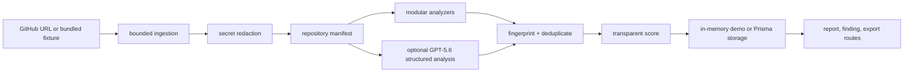

# LaunchGuard architecture

## Boundaries

- `src/server/ingestion` selects files and builds manifests without executing source.
- `src/server/analyzers` contains deterministic, independently testable checks.
- `src/server/scoring` owns fingerprints, deduplication, and score semantics.
- `src/lib/openai` receives redacted context only and validates structured output with Zod.
- `src/server/store` is the MVP storage seam; demo mode is credential-free, while Prisma is ready for PostgreSQL.
- `src/components` renders evidence and review actions; it never receives provider credentials.

## Extension points

Add new repository providers behind an ingestion interface, new analyzer modules behind `RepositoryAnalyzer`, and a durable repository implementation behind the store functions. GitHub pull requests and authentication are intentionally outside the first release.
