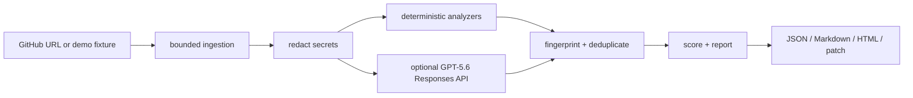

# LaunchGuard

> Turn fragile repositories into deployment-ready releases.

LaunchGuard is a developer tool for the last review before production. It accepts a public GitHub repository URL or a bundled deliberately broken Next.js fixture, performs bounded deterministic analysis, and returns a deployment-readiness score with evidence, impact, remediation, verification steps, checklists, exports, and reviewable patch candidates.


## Why it exists

Applications often work locally while production fails on missing environment variables, unsafe secrets, weak CI gates, broken Docker packaging, migration drift, or platform assumptions. LaunchGuard makes those risks visible before launch day.

## Features

- Credential-free one-click demo against `fixtures/broken-nextjs-app`.
- Public GitHub ingestion with URL validation, tree filtering, size limits, and safe provider errors.
- Modular package, environment, Docker, Next.js, TypeScript, CI/CD, Prisma, documentation, Vercel, and basic AWS analyzers.
- Secret redaction before optional GPT-5.6 analysis.
- Transparent score deductions: critical 20, high 10, medium 5, low 2, with severity caps.
- Finding detail with file evidence, impact, remediation, verification, unified diff, and downloadable patch.
- Markdown, JSON, and printable HTML report exports.
- In-memory demo storage plus Prisma/PostgreSQL persistence when configured.
- Responsive dark “release control room” UI with visible focus states and reduced-motion-friendly CSS.

## Screens and routes

`/` landing and intake · `/scan` intake · `/demo` one-click demo · `/scan/[id]` report · `/scan/[id]/finding/[findingId]` detail · `/about` · `/privacy` · `/docs` · `/api/health`.

## Architecture



See [ARCHITECTURE.md](ARCHITECTURE.md) for boundaries and extension points.

## Local setup (PowerShell)

```powershell
npm ci
Copy-Item .env.example .env
npm run dev
```

Open `http://localhost:3000` and click **Run the broken-repo demo**. Demo mode does not require GitHub, OpenAI, or PostgreSQL credentials.

## Optional environment

Copy `.env.example` to `.env` and set `OPENAI_API_KEY`, `OPENAI_MODEL`, and `OPENAI_REASONING_EFFORT` for live GPT-5.6 analysis; `GITHUB_TOKEN` for better GitHub API limits; `DATABASE_URL` and `DIRECT_URL` for Prisma/PostgreSQL persistence; and the repository limit variables for bounded ingestion. Never put credentials in `NEXT_PUBLIC_*` variables.

## Verification

```powershell
npm run format:check
npm run lint
npm run typecheck
npm test
npm run test:e2e
npm run build
```

`npm run test:e2e` uses Playwright Chromium. If the browser is not installed, run `npx playwright install chromium` once.

## Prisma / Neon

With PostgreSQL configured:

```powershell
npm run db:generate
npm run db:deploy
npm run db:seed
```

The schema stores metadata, redacted manifests, findings, patches, summaries, and checklist state—not a complete repository checkout. See [DEPLOYMENT.md](DEPLOYMENT.md).

## Container runtime

The production `Dockerfile` is multi-stage and runs as a non-root user. This workstation uses rootless Podman through Ubuntu WSL, not Docker Desktop:

```powershell
wsl -d Ubuntu-24.04 -u user -- podman build -t localhost/launchguard:dev .
wsl -d Ubuntu-24.04 -u user -- podman run --rm -p 3000:3000 --env-file .env localhost/launchguard:dev
```

The current environment’s WSL service denied Podman verification, so container smoke testing remains a deployment follow-up; no Docker fallback was used.

## Security and limitations

LaunchGuard is defensive static analysis, not a full security audit or vulnerability database. It never executes repository code, follows instructions inside repository files, or changes a GitHub repository. Read [SECURITY.md](SECURITY.md) and [PRIVACY.md](PRIVACY.md) before scanning sensitive code.

## Hackathon materials

- [DEMO_SCRIPT.md](DEMO_SCRIPT.md)
- [DEVPOST_SUBMISSION.md](DEVPOST_SUBMISSION.md)
- [CODEX_BUILD_LOG.md](CODEX_BUILD_LOG.md)
- [DECISIONS.md](DECISIONS.md)

## License

MIT. See [LICENSE](LICENSE).
